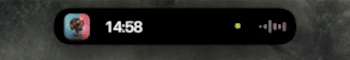
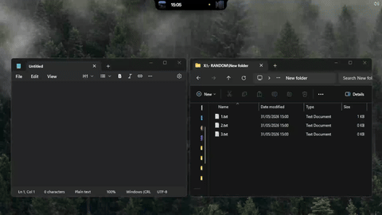

# DynamicWin-Legacy

<p align="center">
  
  <a href="https://creativecommons.org/licenses/by-sa/4.0/"></a>
  <a href="https://discord.gg/UHFuqB9NqR"></a>
  <a href="https://github.com/59xa/DynamicWin-Legacy/actions/workflows/build.yml"></a>
</p>

<p align="center">
  
</p>

<p xmlns:cc="http://creativecommons.org/ns#" xmlns:dct="http://purl.org/dc/terms/"><a property="dct:title" rel="cc:attributionURL" href="https://github.com/59xa/DynamicWin-Legacy">DynamicWin-Legacy</a> developed by <a rel="cc:attributionURL dct:creator" property="cc:attributionName" href="https://github.com/FlorianButz">Florian Butz</a> and <a rel="cc:attributionURL dct:maintainer" property="cc:attributionName" href="https://github.com/59xa">59xa</a> is licenced under <a href="https://creativecommons.org/licenses/by-sa/4.0/?ref=chooser-v1" target="_blank" rel="license noopener noreferrer" style="display:inline-block;">CC BY-SA 4.0</a></p>

> [!WARNING]
> As of **31st May, 2026**, DynamicWin-Legacy is feature complete, and will no longer receive further updates moving forward. The maintainer of this repository will instead shift development focus on DynamicWin's successor. Stay tuned for more details [here](https://github.com/project-vibrance).

> [!NOTE]
> This repository holds the legacy code and releases for DynamicWin developed by [FlorianButz](https://github.com/FlorianButz), and is maintained by [59xa](https://github.com/59xa). Please do not report issues and missing features in this repository regarding V2 as this repository only accepts version 1.0 issues. For V2 releases, click [here](https://github.com/FlorianButz/DynamicWin/releases).

### What is it?
A [Dynamic Island](https://support.apple.com/en-gb/guide/iphone/iph28f50d10d/ios)-inspired Windows software that brings in a bunch of features like widgets or a file tray that works like a clipboard.

Similar to dynamic notches that you can find on macOS like [NotchNook](https://lo.cafe/notchnook), this software brings the concept on Windows devices to life.

_DynamicWin-Legacy supports both **`x64`** and **`arm64`** releases. [Get the latest version for your Windows device here](https://github.com/59xa/DynamicWin-Legacy/releases)._

### Implementation and build
This application is developed using C# for the logic, Windows Presentation Foundation (WPF) for windowing, and [SkiaSharp](https://github.com/mono/SkiaSharp) to display the graphical interface.
To build this project, ensure that you have the latest version of **`.NET 9.0`** installed on your environment.

To get started:
```bash
git pull https://github.com/59xa/DynamicWin-Legacy.git
```

### Future plans/continued support:
- DynamicWin-Legacy is now considered abandonware. Development focus has been shifted to **V3** instead, [more information here](https://github.com/project-vibrance).
- While [V2](https://github.com/FlorianButz/DynamicWin) has been made public, the legacy codebase will continue to exist for other developers and maintainers.
- This repository is not linked to the original repository's fork network. Please report your issues regarding V2 [here](https://github.com/FlorianButz/DynamicWin).
- V1 (this repository) will co-exist with V2, and will not serve as a replacement but an alternative for users to use.
- Feel free to contribute to this project as you wish. Open any issues on the issues page if you encounter any bugs.

# Features
DynamicWin-Legacy has a variety of features, currently including: <br>

## Shortcuts
- [x] `CTRL + Win` hides the interface (or show it again).

## Big widgets
- [x] Media playback (deprecated)
- [x] Timer
- [x] Weather
- [x] Shortcuts <sub>(can be configured to open a file, e.g. shortcut, `.exe`, and/or any other filetype)</sub>

## Small widgets
- [x] Time display
- [x] Audio visualiser
- [x] Device usage detector <sub>(indicates if camera / microphone is in use)</sub>
- [x] Power state display <sub>(shows battery in form of icons, displays connector if battery is not found)</sub>
- [x] Timer <sub>(displays current running timer)</sub>
- [x] Resource usage display

## File distribution & management <br>

<p align="center">
  
</p>

- [x] File Tray <sub><br>
Files can be dragged over the island to add them to the file tray. The tray can be accessed when hovering over the island and clicking on the 'Tray' button. The files are stored until they are dragged out again. They can also be removed by selecting the file and right clicking. A context menu will popup and you can click on - **"Remove Selected Files"** or **"Remove Selected Files"** to copy the files.</sub> <br>

> [!WARNING]
> If you are using the file tray to import files in to an app (e.g. After Effects) make sure to not remove the files from the tray. Apps that only copy a link to the file will be lost after you remove the file from the tray.

## Media player

<p>The media player uses the <b>GSMTC</b> interop to control and display metadata regardless of media source. Integration with other applications through sign-in or API is <b>not</b> required.</p>
<br><br><br>
<br>

## Custom themes
> [!NOTE]
> Custom themes are not the main priority for this repository, but will remain supported for use. Visit FlorianButz's [Discord server](https://discord.gg/UHFuqB9NqR) to get access to more themes.
- Read [THEMING.md](THEMING.md) to get started on decorating your interface.

## Modding DynamicWin-Legacy (making extensions)

- Read [MODDING.md](MODDING.md) for more information on how to get started.
