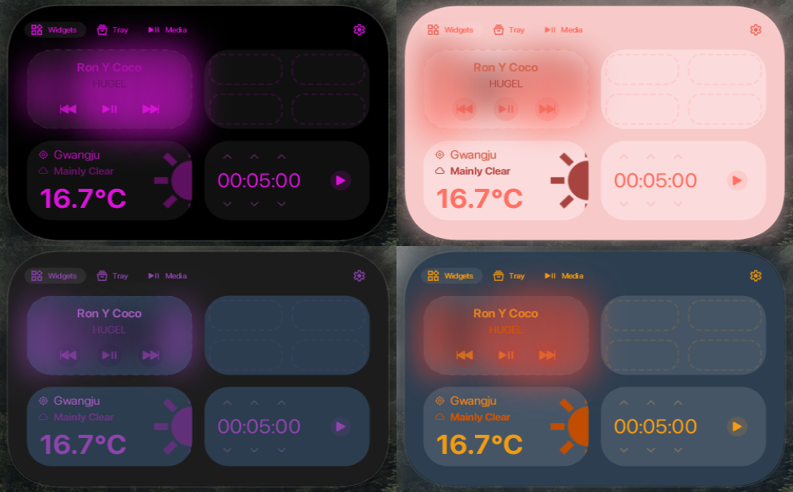

# Theming and customising your interface

  

> [!NOTE]
> Custom themes are not the main priority for this repository, but will remain supported for use. Visit FlorianButz's [Discord server](https://discord.gg/UHFuqB9NqR) to get access to more themes like the ones shown from above.

You can use the built-in dark / light theme. You can also create custom themes that fit your liking by going to the `%appdata%/DynamicWin/Theme.json` file. After editing the colors you need to select the `Custom` theme option in the settings. If you already did that, you will need to go back to the settings and click on it again. Otherwise you would have to restart the app.

This is an example of a color:
`"IslandColor": "#000000"`

The hex code is structured this way: `#rrggbb`. If you want to change the alpha of the color, it is **always** at the start of the code. `#aarrggbb`.